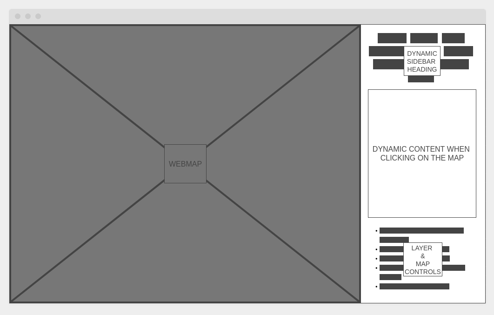
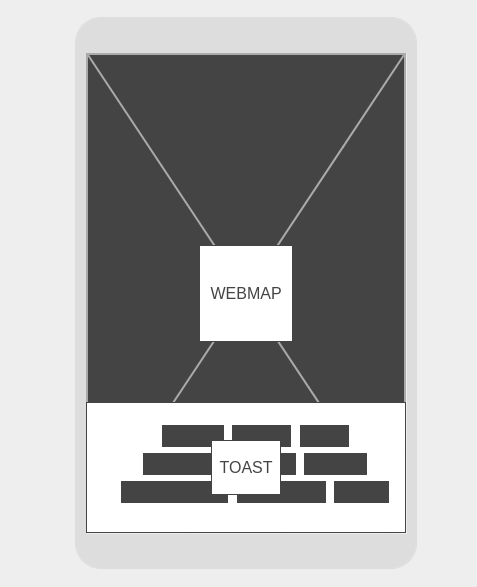

# IssueTrac Web

This is part of the IssueTrac application created as my senior project and provides an Angular single page application (SPA). 

## Usage

```shell
$ git clone git@github.com:nasumilu/issue-trac-web.git
$ cd issue-web-trac
$ ng serve --open
```

## Wireframes






[Back to IssueTrac Project](https://github.com/nasumilu/issue-trac)
